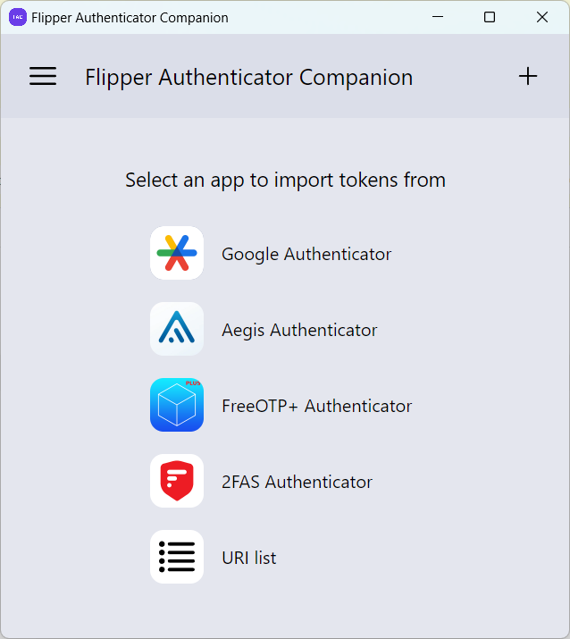

# Flipper Authenticator Companion

[](https://github.com/akopachov/flipper-zero_authenticator-companion/releases/)
[](/LICENSE)
[](https://github.com/akopachov/flipper-zero_authenticator-companion/issues)

[](https://snyk.io/test/github/akopachov/flipper-zero_authenticator-companion)


<a href=".github/screenshots/token-list.png">
  
</a>
<a href=".github/screenshots/add-token.png">
  
</a>
<a href=".github/screenshots/import-tokens.png">
  
</a>

## Description

Flipper Authenticator Companion is a companion application for [Flipper Authenticator](https://github.com/akopachov/flipper-zero_authenticator) software-based TOTP/HOTP authenticator for Flipper Zero device. This application allows to interact with Flipper Authenticator in a more user-friendly way.

## How get it

1. Go to [latest release](https://github.com/akopachov/flipper-zero_authenticator-companion/releases/latest)
2. Download appropriate file for your platform
3. Run it

**IMPORTANT NOTE:**

All the application binaries provided in the releases are unsigned and some anti-virus software may prevent running due to that. To verify file integrity you may check SHA256 checksum provided for every release. Executable files for all platforms are scanned by [Virustotal](https://virustotal.com/) for every release and scan results are available on the release page.

## Build

```console
pnpm config set node-linker hoisted --location project
pnpm install
pnpm build
```

## Development

```console
pnpm install
pnpm dev
```

## Want to say thank you?

* Buy me a coffee [here](https://ko-fi.com/akopachov) (No account needed, one-time)
* Become a patron at [Patreon](https://patreon.com/akopachov) (Account needed)
* [Z.Cash](https://z.cash/): `t1PCzJrd96RUfzjzhBERfXEFvSi7W6V86hM`
* [DOGE](https://dogecoin.com/): `DAa3nu1RCWwxZdAnGVga77bgxDFP1nhahj`
* [TON](https://ton.org/): `EQCSBzoTb1B7RhXnka5RegmdjHR3gQwRVgZHNPPqzjjvlW9T`
