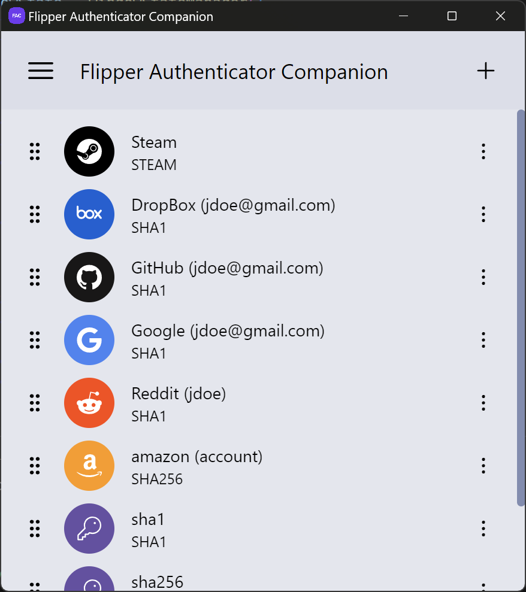
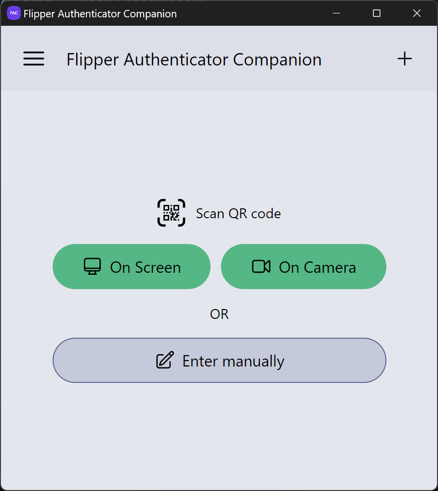

# Flipper Authenticator Companion

## Description

Flipper Authenticator Companion is a companion application for [Flipper Authenticator](https://github.com/akopachov/flipper-zero_authenticator) software-based TOTP authenticator for Flipper Zero device. This application allows to interact with Flipper Authenticator in a more user-friendly way.

## Support

* Buy me a coffee [here](https://ko-fi.com/akopachov), [here](https://www.buymeacoffee.com/mijumoho), [here](https://donorbox.org/flipper-authenticator) or [here](https://buycoffee.to/akopachov)
* Become a patron at [Patreon](https://patreon.com/akopachov)
* BTC: `bc1qu9k48q93uhvr9w5cn8fzz5yxuvh4e27c6hnczq`
* ETH: `0xa12163eD56e35d3B38F7087B573384E40b2785e1`
* USDT: `0xa12163eD56e35d3B38F7087B573384E40b2785e1`
* DOGE: `DAa3nu1RCWwxZdAnGVga77bgxDFP1nhahj`
* TON: `EQCSBzoTb1B7RhXnka5RegmdjHR3gQwRVgZHNPPqzjjvlW9T`
